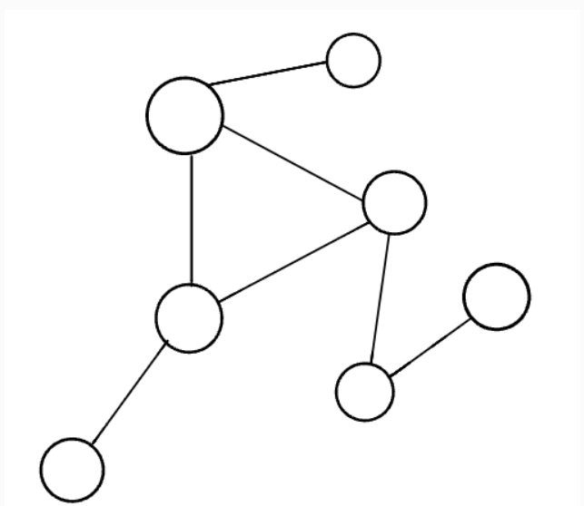
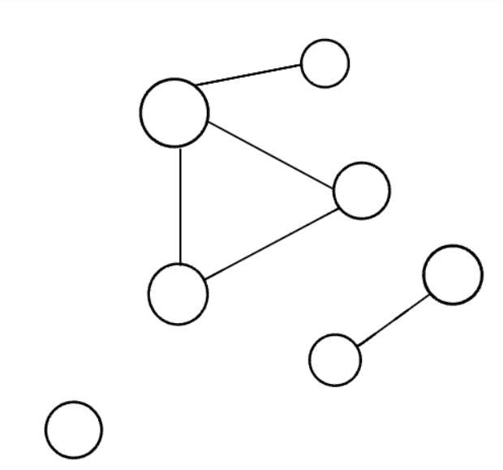
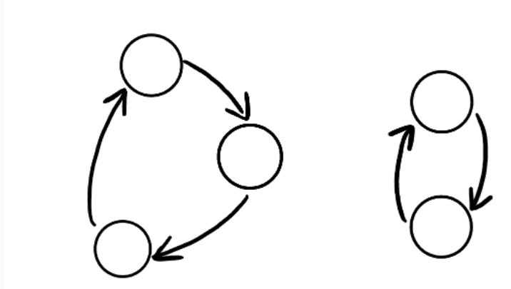
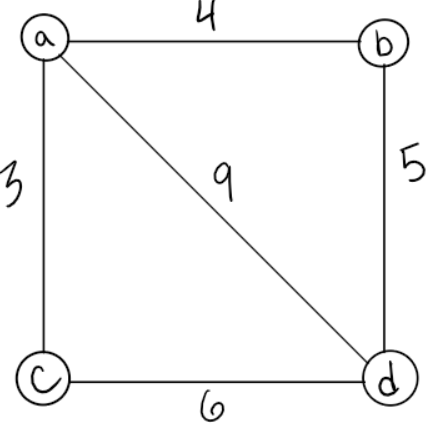

# Graphs Reading
A graph is a non-linear data structure that can be looked at as a collection of vertices (or nodes) potentially connected by line segments named edges.

Here is some common terminology used when working with Graphs:

* Vertex - A vertex, also called a “node”, is a data object that can have zero or more adjacent vertices.
* Edge - An edge is a connection between two nodes.
* Neighbor - The neighbors of a node are its adjacent   nodes, i.e., are connected via an edge.
* Degree - The degree of a vertex is the number of edges connected to that vertex.

## Undirected Graphs
An Undirected Graph is a graph where each edge is undirected or bi-directional.
This means that the undirected graph does not move in any direction.

## Directed Graphs
A Directed Graph is a graph where each edge is directed and only goes in one direction.
It's also known as "Digraph".

## Types of Graphs:
Complete Graph - A complete graph is a graph in which all vertices (nodes) are connected to all other vertices.

connected Graph - A connected graph is a graph in which all nodes has one edge to another node.

disconnected Graph - A disconnected graph is a graph in which  nodes may not have any edges to other nodes.

## Acyclic vs Cyclic
### Acyclic Graph
An acyclic graph is a directed graph without cycles.

A cycle is when a node can be traversed through and potentially end up back at itself.

## Cyclic Graphs
A Cyclic graph is a graph that has cycles.

A cycle is defined as a path of a positive length that starts and ends at the same vertex.

### Weighted Graphs
A weighted graph is a graph with numbers assigned to its edges. These numbers are called weights. This is what a weighted graph looks like:

## Graphs Traversal

### Breadth First Search
Breadth First Search is a search algorithm that traverses a graph in a breadth first manner.

        ALGORITHM BreadthFirst(vertex)
        DECLARE nodes <-- new List()
        DECLARE breadth <-- new Queue()
        DECLARE visited <-- new Set()

        breadth.Enqueue(vertex)
        visited.Add(vertex)

    while (breadth is not empty)
        DECLARE front <-- breadth.Dequeue()
        nodes.Add(front)

        for each child in front.Children
            if(child is not visited)
                visited.Add(child)
                breadth.Enqueue(child)

    return nodes;

### Depth First Search
Depth First Search is a search algorithm that traverses a graph in a depth first manner.