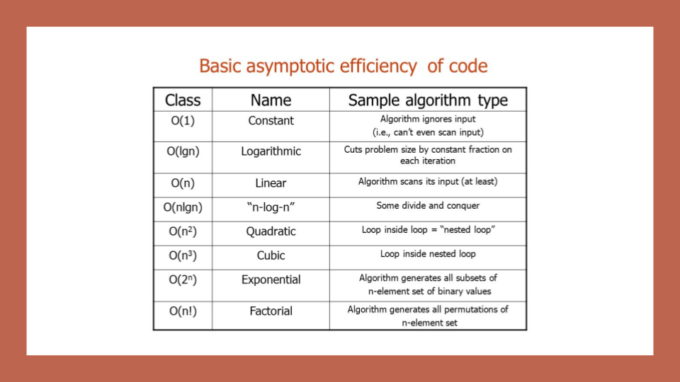

# class05 Reading
## BigO reading :
* Big O: The worst case analysis of algorithm efficiency.
* Running Time: The amount of time required for an algorithm to complete.
* Memory Space: The amount of memory resources required for an algorithm to complete.
* Input Size: Represented by the variable n, the total size of values used as parameters in an algorithm.
* Big Omega: The best case analysis of algorithm efficiency.
* Big Theta: The typical or random case used for analysis of algorithm efficiency.

# Linked Lists reading

### A Linked List is a sequence of Nodes that are connected/linked to each other. The most defining feature of a Linked List is that each Node references the next Node in the link.
### This how it looks like :

### Linked lists are dynamic data structures. A static data structure needs all of its resources to be allocated when the structure is created; this means that even if the structure was to grow or shrink in size and elements were to be added or removed, it still always needs a given size and amount of memory

### linked list is usually efficient when it comes to adding and removing most elements, but can be very slow to search and find a single element.

## linked list nodes(elements) insertion

### types of Linked lists

* ####  Singly - Singly refers to the number of references the node has. A Singly linked list means that there is only one reference, and the reference points to the Next node in a linked list.
* #### Doubly - Doubly refers to there being two (double) references within the node. A Doubly linked list means that there is a reference to both the Next and Previous node.

